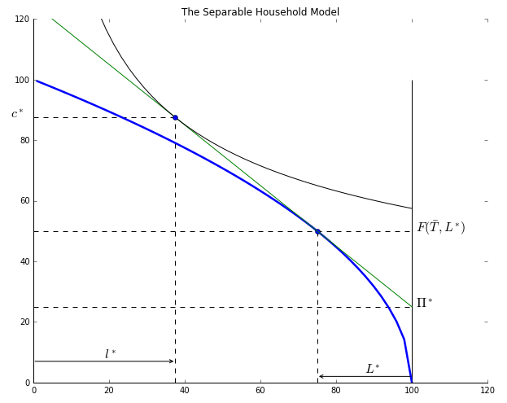
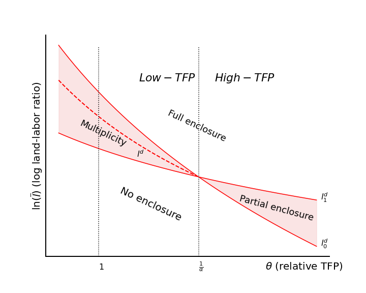
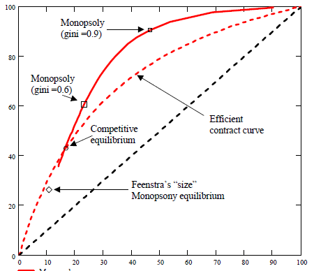

# Teaching and Code

```{contents}
```
 
 ### Fall 2021 Courses
 
::::{panels}
**Econ 100: Introduction to Economics**

([Tophat course site](https://app.tophat.com/e/975233))
---
**Econ 842: Development Seminar II (PhD)**

(see below)
::::


### Code for Teaching and Replication

I like to work with [jupyter](https://jupyter.org), python, geogebra, and other scientific computing and open source tools. Over the years I've build a large number of interactive notebooks and geogebra applets to teach economics and reproduce economics research.  Here are a few of those resources assembled as [jupyter books](https://jupyterbook.org) and shared via github repositories.

All these links will navigate to new sites:

::::{panels}
[Econ-Teach](https://jhconning.github.io/Econ-Teach/) notebooks and apps 
^^^^
**Teaching Economics with Python and Geogebra.**

[](https://jhconning.github.io/Econ-Teach) 

---
[Development Seminar II (PhD)](https://jhconning.github.io/DevII) 
^^^

**Jupyter Notebooks and other Content.**

[](https://jhconning.github.io/DevII) 

see also [earlier site](https://dev-ii-seminar.readthedocs.io/en/latest/) (with extra not yet converted content). 

::::

---

::::{panels}
[The Economics of Land Governance](https://github.com/jhconning/land_uct_2019) 
^^^^
University of Cape Town, 2019 and 2018. Part of a six-week course.

[](https://github.com/jhconning/land_uct_2019) 

---
[The Enclosure Projects](https://jhconning.github.io/enclosure_book/)
^^^
Replication code for research papers with Matt Baker.

[](https://jhconning.github.io/enclosure_book/) 

::::

::::{panels}
[Commitments under Threat](https://jhconning.github.io/commitments/)
^^^^
Replication code for paper with Karna Basu.
[](https://jhconning.github.io/commitments/)

---
[Factor Market Power in General Equilibrium](https://github.com/jhconning/geqfarm)
^^^^
Code framework for papers including "[Latifundia Economics](https://drive.google.com/file/d/1-9--pUqo_ppfc8E-SQn9ElJRUYIw-X2p/view?usp=sharing)" and "[On the Causes of Slavery and Serfdom: Domar Revisited](https://drive.google.com/file/d/1EZZJdDASDdlpFHRbnSXL9aohyl5V0Q7z/view?usp=sharing)"

[](https://github.com/jhconning/geqfarm)

::::


### Past Recent Past Courses
-**Eco 701: Microeconomic Theory**
- **Eco 340: International Trade** --  [class Twitter feed](https://twitter.com/HCtrades)  
- **Eco 740: International Trade (MA)**
- **[The Economics of Land Governance](https://github.com/jhconning/land_uct_2019)**, U Cape Town, 2019.


