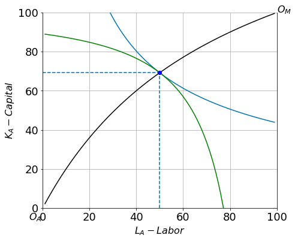
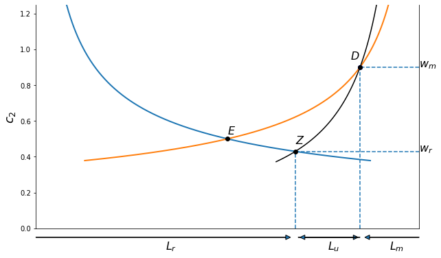

## example grid

::::{grid} 2

:::{grid-item-card}  [Economics with Python & Geogebra](https://jhconning.github.io/Econ-Teach)

:::

:::{grid-item-card}  [PhD Development Seminar II](https://jhconning.github.io/DevII)
 

:::

:::{grid-item-card}  Eco 340: International Trade (Fall 2022)
[(Interactive applets and notebooks)](https://jhconning.github.io/Econ-Teach/notebooks/trade/trade_geogebra.html) 
:::

:::{grid-item-card}
:::

::::

::::{grid} 1

:::{grid-item-card}  Recent Past Courses
- **Eco 842: Development Seminar II (PhD)** (see below)
- **Eco 701: Microeconomic Theory**
- **Eco 740: International Trade (MA)**
- **[Land Tenure](https://github.com/jhconning/land_uct_2019)** (U Cape Town, 2019).
:::

::::

