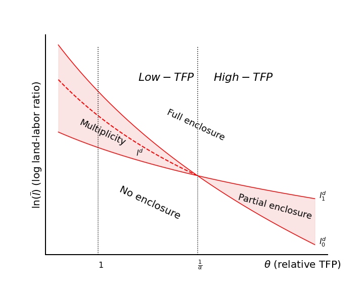
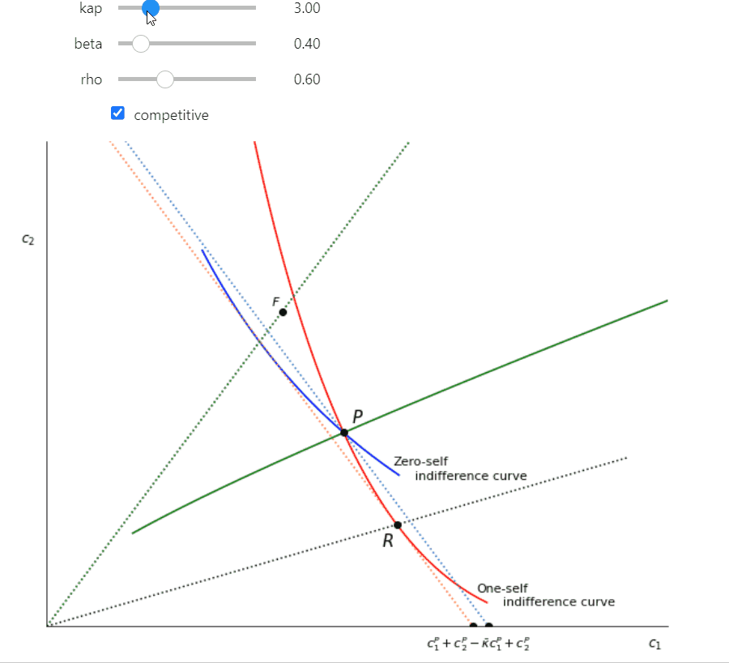

<H1 style="text-align:center;">
Research
</H1>

- [Google Scholar Page](http://scholar.google.com/citations?user=Cc1TG-AAAAAJ&hl=en)
- [published and other papers](research.md)

#### New Papers

>Baker, Matthew and Jonathan Conning (2026) [A Model of Enclosures: Coordination, Conflict, and Efficiency in the Transformation of Land Property Rights](https://drive.google.com/open?id=1x7P-4pqeKXNnZa0WFsfpsvTzFkT_B3ve&usp=drive_fs), Review of Economic Studies, *forthcoming.*

::::{tab-set}

:::{tab-item} Paper and Replication
[Paper and Replication Code](https://open-enclose.github.io/)

:::

:::{tab-item} Abstract
**Abstract:** Economists and historians have long debated how open-access areas, frontier regions, and customary landholding regimes transformed into private property. This paper analyzes decentralized enclosure processes using the theory of aggregative games, examining how population density, enclosure costs, potential productivity gains, and local governance capacity, including the power to demand compensation, jointly determine the mix of property regimes. Depending on these fundamentals, private decisions to enclose may be strategic complements or substitutes. Strategic complements generate tipping points and socially destructive property races, whereas strategic substitutes produce smoother transitions and may leave enclosure below the social optimum. While policies to strengthen customary governance or compensate displaced stakeholders can realign incentives, addressing one market failure while neglecting others can worsen welfare.
:::

::::

>Basu, Karna and Jonathan Conning (2021) [Commitments under Threat: Present-Bias, Renegotiation, and Consumer Protection Forms,](https://jhconning.github.io/commitments/) manuscript, under submission.  

::::{tab-set}

:::{tab-item} Paper and Replication
[Paper and Replication Code](https://jhconning.github.io/commitments/)

:::

:::{tab-item} Abstract
**Abstract:** Hyperbolic discounters value consumption-smoothing commitment contracts, but may fear that these could be renegotiated by future selves and banks. This creates a consumer protection problem even for sophisticated and informed consumers. This paper studies how the threat of renegotiation affects equilibrium commitment contracts and bank governance forms. We find that familiar behaviors such as ‘over’-borrowing or ‘under’-saving emerge, but here as strategic partial concessions to future selves to avoid even costlier renegotiation behaviors later. We then show how it may be to banks’ advantage to offer additional consumer protection either via an appeal for government regulation or through costly private governance/ownership choices. By restricting their own ability to profit from opportunistic renegotiation, banks can expand gains to trade and captured profits. The framework establishes new behavioral micro-foundations for a theory of commercial non-profits and helps explain historical patterns of contracting and ownership forms in consumer banking and microfinance, and how these co-evolved with market structure.
:::

::::
