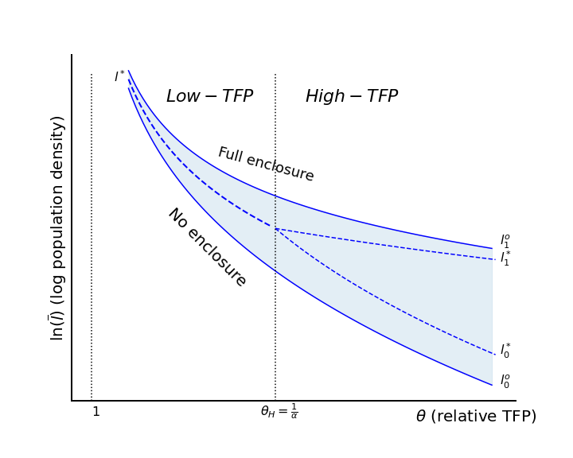

## Code for Research

Notebooks with code to document and reproduce research shared as jupyter books and github repositories.

::::{grid} 2

:::{grid-item-card} [A Model of Enclosures](https://jhconning.github.io/enclosure_book/content.html)
 
:::

:::{grid-item-card} [Commitments under Threat](https://jhconning.github.io/commitments/)
Replication code for paper with Karna Basu.

:::

:::{grid-item-card} [Factor Market Power in General Equilibrium](https://github.com/jhconning/geqfarm)
Code framework for papers including "[Latifundia Economics](https://drive.google.com/file/d/1-9--pUqo_ppfc8E-SQn9ElJRUYIw-X2p/view?usp=sharing)" and "[On the Causes of Slavery and Serfdom: Domar Revisited](https://drive.google.com/file/d/1EZZJdDASDdlpFHRbnSXL9aohyl5V0Q7z/view?usp=sharing)"

:::

::::

